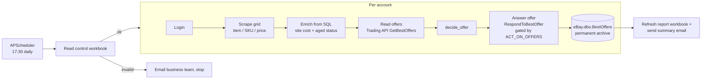

# ebay-best-offers

Daily automation that reviews every pending eBay Best Offer across a fleet of
seller accounts and records a priced decision for each one. It reads the pricing
rules from a staff-editable control workbook, scrapes each account's pending
offers from Seller Hub, enriches every SKU with its cost and aged status from SQL
Server, reads the buyer's offer, decides Accept / Counteroffer / Decline against a
profit-margin rule, answers each offer on eBay through the Trading API, and writes
the full result to a permanent SQL archive. It then refreshes a read-only report
workbook and sends an end-of-day summary email.

The design is **SQL-first**: Python computes every number and stores it in
`eBay.dbo.BestOffers`; the workbook and the email are read-only presentation
layers. The interesting work is the **margin decision rule**, the **eBay Trading
API** that both reads every buyer offer (paging through all results, sidestepping
eBay's bot challenge entirely) and sends each response, and the **idempotent,
append-only archive** that never loses a day.

> **Status:** **live.** `ACT_ON_OFFERS=true` — the acting step (Accept / Counter /
> Decline via the Trading API) answers real buyer offers (live since 2026-07-10).
> Setting `ACT_ON_OFFERS=false` returns it to a dry run: it decides, records, and logs
> the response it *would* send, sending nothing.

## Daily flow (17:30, every day)

1. **Read settings** from the control workbook (commission, the minimum profit
   floors, counteroffer discount band). If a value is missing or out of
   range, the run stops and emails the business team exactly what to fix, so no
   offer is ever priced on a bad number.
2. **Scrape pending offers** for each seller account from Seller Hub.
3. **Enrich from SQL** — match each SKU to its site cost and aged status.
4. **Read every buyer offer** from the eBay Trading API (`GetBestOffers`, paging
   through all results) per account — no browser, so eBay's bot check can't fire.
   Offers are matched onto the scraped rows by item number, one row per offer, so a
   listing with several offers has all of them handled.
5. **Decide** per offer: Accept, Counteroffer, or Decline, or a skip reason
   (Expired Offer, Out of Stock, Missing Site Cost).
6. **Answer** each offer on eBay (`RespondToBestOffer`) — Accept, send the
   counteroffer with its buyer message, or Decline with its message. Gated behind
   `ACT_ON_OFFERS`: off, it logs the intended action and sends nothing.
7. **Record** the full row to `eBay.dbo.BestOffers` — the permanent archive.
8. **Report** — refresh the read-only workbook and send the summary email. Its table
   has a column per outcome except Expired Offer (dropped once the pagination fix
   stopped producing them); the Total sums the columns shown, and the workbook still
   carries every row.

## Architecture



## Decision rule

`decide_offer(cx_offer, current_price, site_cost, weight_oz, aged_status,
sell_below_cost, settings, out_of_stock, account)`
is a pure function from the offer's numbers to `(action, counter_price, margin)`.
For each offer it tests, in order:

1. **Expired Offer** — the buyer's offer is no longer readable.
2. **Out of Stock** — the listing has no sellable quantity, so eBay would block an
   Accept/Counter; the offer is recorded and shown but never answered.
3. **Missing Site Cost** — the SKU has no cost in SQL (the `0` / `0.01` sentinel).
4. **Accepted** — the buyer's own offer already clears the minimum profit floor.
5. **Counteroffer** — the biggest discount within the allowed band that still
   clears the floor (the best price for the buyer that still protects us).
6. **Declined** — even the shallowest allowed discount can't clear the floor.

The **minimum profit floor is per-item**: the default, eased to a lower floor for
Slow / Dead aged items or an EnableSellingBelowCost SKU (the lowest applicable wins), so
flagged inventory can be countered deeper. Every threshold comes from the control
workbook, never from the code.

**Some accounts override all of that.** An account listed in `flat_min_profit_accounts`
(in gitignored `config/accounts.json`) prices every item to a single flat floor, aged or
not — the Slow / Dead / below-cost easings never apply to it. The config maps the account
to its own label in the settings workbook:

```json
"flat_min_profit_accounts": { "Account4": "Account4 minimum profit margin" }
```

Each configured label becomes a **required** workbook value, so a missing cell stops the
run like any other setting instead of quietly pricing at the default floor. Account names
and their margins stay out of this public repo.

```text
margin      = (price - total_cost - price * commission) / price
total_cost  = site_cost + est_shipping(weight_oz)
est_shipping = a fixed dollar amount per weight tier (item weight from SellerCloud),
               e.g. <=1 lb $8, 2-3 lb $10, 11-20 lb $20, >100 lb $100; a zero or
               missing weight uses the lowest ("incorrect weight") tier at $15
```

The est_shipping weight tiers are a pricing table in code (`SHIPPING_TIERS`).

## The permanent archive

`eBay.dbo.BestOffers` is **append-only and never truncated** — every past day is
kept. The report shows only today (its Power Query filters on `report_date`).
Same-day reruns are idempotent per account: an account's not-yet-answered rows are
replaced with the latest scrape, and an account whose offers were all answered is
skipped. Accounts are independent: one that fails is skipped and the rest still run.
Its rows are cleared only if the failure hit the insert itself, so a failure earlier
in the account (browser, API) leaves an earlier run's rows intact. Failed accounts
are named in a banner on the summary email and in one crash report sent at the end;
the run exits non-zero only if no account was recorded at all.

## Settings (control workbook)

Business users edit `Best-Offers-Settings.xlsx`, read with pandas (no Excel COM):
commission; the minimum profit floors (default, Slow, Dead, sell-below-cost, plus one
per flat-floor account); and the min/max counteroffer discount. Shipping is estimated
from each item's weight, so it is not a workbook value. Nothing else business-tunable
lives in code or environment variables. A missing or invalid value stops the run and
sends a plain-language fix-it email.

## Logging

Configured once via the shared helper:

```python
from seller_automation_utils.logging_utils import setup_logging
log = setup_logging("ebay_best_offers")
```

A Rich console handler (colorized, rich tracebacks) plus a rotating file handler
writing to `logs/ebay_best_offers.log`. A custom `SUCCESS` level marks milestones
(`log.success(...)`).

## Project layout

```
.
├── run_ebay_best_offers.py     # the automation — single file by design
├── vba/
│   └── modUtilities.bas        # canonical source for the report workbook's VBA
├── config/
│   ├── accounts.json           # eBay profile names (gitignored; .example tracked)
│   └── paths.json              # workbook & report paths (gitignored; .example tracked)
├── tests/                      # pure-function branch tests (pytest)
├── logs/  output/  downloaded_files/  screenshots/   # working dirs (.gitkeep only)
├── requirements.txt
├── README.md
└── LICENSE
```

## Setup

### 1. Clone and create the venv

```powershell
git clone https://github.com/dominicci13/ebay-best-offers.git
cd ebay-best-offers
py -3.12 -m venv .venv
.venv\Scripts\pip install -r requirements.txt
.venv\Scripts\pip install git+https://github.com/dominicci13/shared-python-utils.git
```

### 2. Configure

```powershell
copy .env.example .env
copy config\accounts.json.example config\accounts.json
copy config\paths.json.example config\paths.json
```

Edit each with real values: credentials and email addresses in `.env`; eBay
profiles in `config\accounts.json`; workbook and report paths in
`config\paths.json`. All three are gitignored.

### 3. Report workbook (one-time)

The report workbook (`Best-Offers.xlsm`, path in `config\paths.json`) holds one
Power Query over `eBay.dbo.BestOffers` filtered to today, plus the `modUtilities`
macros from `vba/modUtilities.bas` (a `refresh` that forces a synchronous query
refresh). The script opens it hidden, refreshes it, saves, and attaches it — so
keep the workbook **closed** while a run is in progress.

### 4. Run

```powershell
.venv\Scripts\python run_ebay_best_offers.py
```

Answer **Y** to run immediately, or **N** to register the APScheduler job and idle
until the next **17:30 daily** trigger.

### Tests

```powershell
$env:PYTEST_DISABLE_PLUGIN_AUTOLOAD=1; .venv\Scripts\python -m pytest -q
```

(The env var sidesteps a seleniumbase pytest-plugin import that needs setuptools.)

## Environment variables

| Variable | Description |
|---|---|
| `CHROME_USER_DATA_DIR` | Path to the dedicated Chrome automation profile directory |
| `eBay_pass` | eBay account password (browser grid scrape / login) |
| `EBAY_APP_ID` / `EBAY_DEV_ID` / `EBAY_CERT_ID` | eBay Trading API app keyset (one app covers all accounts) |
| `EBAY_AUTH_TOKEN_<ACCOUNT>` | Trading API user token per seller account (e.g. `EBAY_AUTH_TOKEN_ACCOUNT1`) |
| `ACT_ON_OFFERS` | Safety gate. `false`/unset = dry run (decide + record, send nothing). `true` = answer offers on eBay for real |
| `ALERT_EMAIL` | Outlook recipient for crash reports (screenshot + traceback) |
| `SENDER_EMAIL` | Outlook account the summary email is sent from |
| `TO_EMAIL` | Recipient(s) of the summary email, comma-separated (default: `SENDER_EMAIL`) |
| `CC_EMAIL` | Optional CC recipient(s), comma-separated |
| `SETTINGS_ALERT_TO` | Business recipient(s) of the settings fix-it email |
| `SETTINGS_ALERT_BCC` | Optional BCC on the settings fix-it email |

Business tunables (commission, profit floors, discount band) are
**not** environment variables — they live in the control workbook. Shipping is
estimated from each item's weight (see the pricing rules above).

## Author

Built by **Brian Ramírez** ([@dominicci13](https://github.com/dominicci13)),
automation & AI workflow specialist. More on my
[GitHub profile](https://github.com/dominicci13) and
[LinkedIn](https://linkedin.com/in/bdramirez).

## License

MIT — see [LICENSE](LICENSE).
