# ebay-best-offers

Daily automation that closes out every pending eBay Best Offer across a fleet
of seller accounts. It scrapes the seller-hub list, syncs the rows into SQL
Server, refreshes a pricing workbook driven by Power Query, decides
Accept / Counter / Remove for each offer against a configurable profit-margin
rule, drives the browser to act on the decision, and emails an end-of-day
summary. The interesting work is the **decision rule**, the
**Python ↔ VBA boundary** that drives Excel without ever showing it, and the
**resilient scraper** that survives eBay rendering screen-reader noise inline
with the data.

## Architecture

```mermaid
flowchart LR
    sched[APScheduler<br/>17:30 daily] --> scrape

    subgraph scrape[Scrape pending offers]
        direction TB
        login[Login per account] --> grid[Read offers grid]
        grid --> parse[_parse_offer_row]
    end

    parse --> db[(SQL Server<br/>PendingOffers)]
    db --> wb

    subgraph wb[Pending-Offers.xlsm — hidden]
        direction TB
        refresh[Module1.RefreshAll<br/>sync Power Query] --> sort[Module1.SortAll]
    end

    sort --> decide

    subgraph decide[Per-offer decision loop]
        direction TB
        read[Read row from sheet] --> rule[_decide_offer]
        rule --> act[Drive browser:<br/>accept / counter]
        act --> write[Write outcome to sheet]
    end

    write --> finalize[Module1.Reorganize<br/>save workbook]
    finalize --> email[Outlook email<br/>per-account summary]
```



## Decision rule

`_decide_offer` is the heart of the script — a pure function from offer
inputs to `(action, counteroffer_amount)`. For every offer it tests, in
order:

1. **Removed by Buyer** if the offer is missing, the SKU's site cost is the
   sentinel `0` or `0.01`, or the SKU's brand is on the blocked-brands list.
2. **Accept** if accepting the customer's offer would clear the profit
   threshold (currently `≥ 11%` of the sale price after eBay's commission).
3. **Counter at the floor** (`MAX_DISCOUNT × list_price`, e.g. 90% of list)
   if the floor would clear the threshold but the ceiling would not.
   *(Mathematically unreachable when commission is constant — preserved as a
   rule rather than a behavior.)*
4. **Counter at the ceiling** (`MIN_DISCOUNT × list_price`, e.g. 95% of list)
   if the ceiling clears the threshold and the customer's offer does not.
5. **Counter just below list** (`list_price − $0.01`) otherwise.

#### Worked example

List price `$200`, total cost `$150`, commission `9.1%`, MIN_DISCOUNT `0.95`,
MAX_DISCOUNT `0.9`, threshold `11%`. A buyer offers `$160`:

| Price tested        | Value | Profit % at that price | Branch result   |
|---------------------|------:|-----------------------:|-----------------|
| Customer's offer    | $160  |                   2.4% | not enough → ↓  |
| Floor (90%)         | $180  |                   7.6% | not enough → ↓  |
| Ceiling (95%)       | $190  |                  11.8% | clears → **counter at $190** |

The script writes `Counteroffer / $190` to the sheet and drives the browser
to submit it.

## Performance notes

The script's three slowest legs are Excel refresh, Excel cell I/O, and the
browser scrape. This version tunes the first two:

- **Synchronous query refresh.** `Module1.RefreshAll` no longer calls
  `ThisWorkbook.RefreshAll` (which dispatches every Power Query
  asynchronously and returns immediately). It iterates each connection,
  forces `BackgroundQuery = False`, and refreshes them in order. The Python
  side drops two `time.sleep(5)` waits that previously covered the async
  case.
- **Excel runs hidden.** The script opens Excel via
  `xl.App(visible=False, add_book=False)` and quits it in `finally`. No
  flashing window, no stolen focus, safe for scheduled runs.
- **Bulk column read.** `fc_utils.custom_functions.first_empty_row` now
  reads the column in one COM round-trip and scans in Python, instead of
  one COM call per cell. The win scales with table size.
- **VBA hardening.** `RefreshAll`, `SortAll`, and `Reorganize` all run
  inside `ScreenUpdating=False`, `Calculation=xlCalculationManual`,
  `EnableEvents=False`, with `On Error GoTo Cleanup` blocks that restore
  the Application state even on failure.

The canonical VBA source lives in `vba/Module1.bas` so the macros are
version-controlled alongside the Python.

## Logging

```text
21:03:43 INFO     Navigating to pending offers for AccountKeyA.
21:03:51 INFO     Retrieving 23 out of 23 offers from eBay.
21:04:09 INFO     Offer accepted at $190 (11.8% profit).
21:04:14 INFO     Offer countered at $185.00 (price lowered by $0.01, 7.5% profit).
```

Configured once via the shared helper:

```python
from fc_utils.logging_utils import setup_logging
log = setup_logging("ebay_best_offers")
```

`setup_logging` wires a Rich console handler (colorized output, markup
rendering, rich tracebacks) and a 1 MB rotating file handler writing to
`logs/<name>.log`. Available to every automation that imports `fc_utils`.

## Setup

### 1. Install dependencies

```bash
pip install -r requirements.txt
pip install git+https://github.com/dominicci13/shared-python-utils.git
```

### 2. Configure environment

```bash
cp .env.example .env
```

Edit `.env` with your credentials, SQL table names, and offer thresholds.

## Run

```bash
python run_ebay_best_offers.py
```

The script prompts whether to run immediately, then schedules itself to run
at 17:30 daily via APScheduler.

## Environment variables

| Variable | Description |
|---|---|
| `eBay_pass` | eBay account password |
| `CHROME_USER_DATA_DIR` | Path to the Chrome automation profile directory |
| `ALERT_EMAIL` | Outlook recipient for unhandled-exception crash reports |
| `SENDER_EMAIL` | Outlook account used to send the report email |
| `TO_EMAIL` | Comma-separated list of recipient email addresses |
| `CC_EMAIL` | Comma-separated list of CC email addresses |
| `DB_TABLE_PENDING` | SQL table for pending offers (default: `PendingOffers`) |
| `DB_TABLE_AGED` | SQL table for aged inventory (default: `AgedInventory`) |
| `EBAY_COMMISSION` | eBay fee rate as a decimal (default: `0.091`) |
| `MIN_DISCOUNT` | Ceiling price as a fraction of list (default: `0.95`) |
| `MAX_DISCOUNT` | Floor price as a fraction of list (default: `0.9`) |
| `MIN_PROFIT` | Minimum profit margin (currently informational — code uses `0.11`) |
| `BRANDS` | Comma-separated list of blocked brand names |

## Project layout

```
.
├── run_ebay_best_offers.py   # the script — single file by design
├── vba/
│   └── Module1.bas              # canonical source for the workbook's VBA
├── config/
│   ├── accounts.json            # eBay profile names (gitignored)
│   └── paths.json               # workbook & aged-inventory paths (gitignored)
├── logs/                        # rotating logger output (gitignored)
├── requirements.txt
└── README.md
```

## License

MIT — see [LICENSE](LICENSE).
